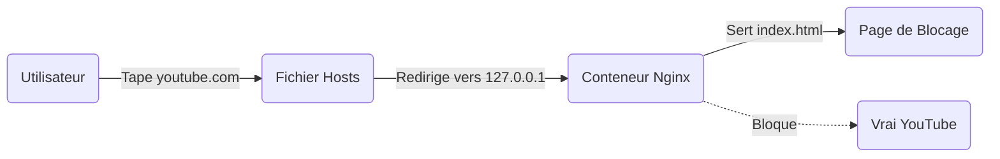

# 🛡️ Procrastination Killer


Une solution **Infrastructure-as-Code** pour la discipline numérique. Ce projet utilise le **DNS Spoofing local**, une **PKI (Public Key Infrastructure)** personnalisée et **Docker** pour rediriger les sites distractifs (YouTube, Instagram, etc.) vers une page de 'Reality Check' auto-hébergée.

---

## Architecture

Le système intercepte les requêtes DNS au niveau du système d'exploitation et répond avec l'adresse d'un conteneur Docker local au lieu du vrai site. Nginx sert alors une page de rappel à l'ordre via HTTPS, grâce à une autorité de certification (CA) générée localement.



## Stack Technique

- 🐳 **Conteneurisation :** Docker & Docker Compose
- 🌐 **Serveur Web :** Nginx (Alpine Linux)
- 🛡️ **Sécurité :** OpenSSL (Génération de Root CA & Certicats Self-Signed)
-   **Réseau :** Manipulation DNS via `etc/hosts` 
- 💻 **Frontend :** HTML/CSS (Page de blocage)

## Prérequis

- Système sous Linux (Ubuntu/Debian recommandés) ou à défaut WSL2 sous Windows
- `git`, `docker` et `docker compose` installés
```bash
sudo apt update
sudo apt install -y docker.io docker-compose-plugin git
```

## Installation Rapide

### Cloner le projet
```bash
git clone [https://github.com/ton-pseudo/procrastination-killer.git](https://github.com/ton-pseudo/procrastination-killer.git)
cd procrastination-killer
```

### Génération del'Autorité de Certification (PKI)
Dans le but d'éviter les erreurs SSL/HTTPS dans le navigateur, il est nécessaire de générer nos propres clefs de sécurité. Le script `setup.sh` est fourni pour automatiser cette tâche.
```bash
chmod +x setup.sh
./setup.sh
```
### Importation du Certificat

 Dernière étape manuelle importante :

 1. Ouvrir votre navigateur (Firefox/Chrome).
 2. Se rendre dans les paramètres de certificats.
 3. Importer le fichier suivant dans les AUTORITÉS :
    ./certs/rootCA.pem$
 4. Cochez 'Faire confiance pour identifier des sites web'.

 ### Lancer le Bouclier !
 ```bash
 docker compose up -d
 ```

### Activation du piège
Modification du fichier hosts pour rediriger les requêtes de distractions vers votre machine locale (ou votre DNS si vous l'installer sur une infra)

Sur Linux/MAC :
```bash
# Ajoute les domaines en une seule fois
echo -e "\n# PROCRASTINATION-KILLER\n127.0.0.1 youtube.com\n127.0.0.1 www.youtube.com\n127.0.0.1 instagram.com\n127.0.0.1 www.instagram.com\n127.0.0.1 tiktok.com" | sudo tee -a /etc/hosts
```

## Personnalisation

**Modification de la liste des sites bloqués :**
    1. Modifier le fichier `setup.sh` (section `[alt_names]`) pour ajouter des domaines.
    2. Relancer `./setup.sh`
    3. Ajouter les domaines dans `/etc/hosts`
    4. Redémarrage du conteneur avec `docker compose restart`

**Modification de la Page de Blocage :**
Il est possible de changer le message par autre chose, le fichier se trouve ici : `./content/index.html`
Les changements sont immédiats (montage volume), il suffit de rafraichir la page.

## Désactivation
1. Ouvrer `/etc/hosts` et commenter les lignes concernées avec `#`.
2. Ou stopper le conteneur :
```bash
docker compose stop
```